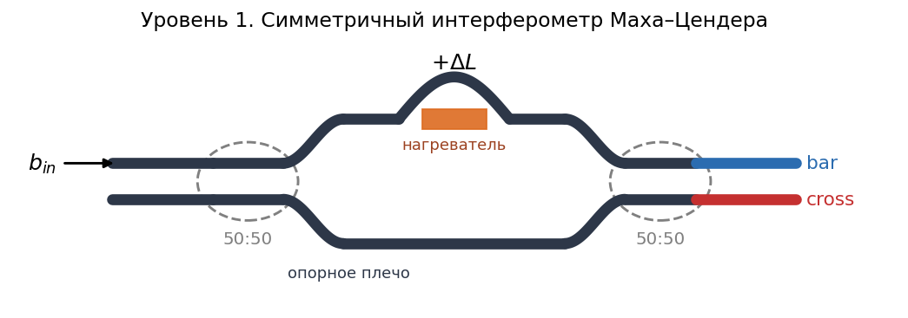
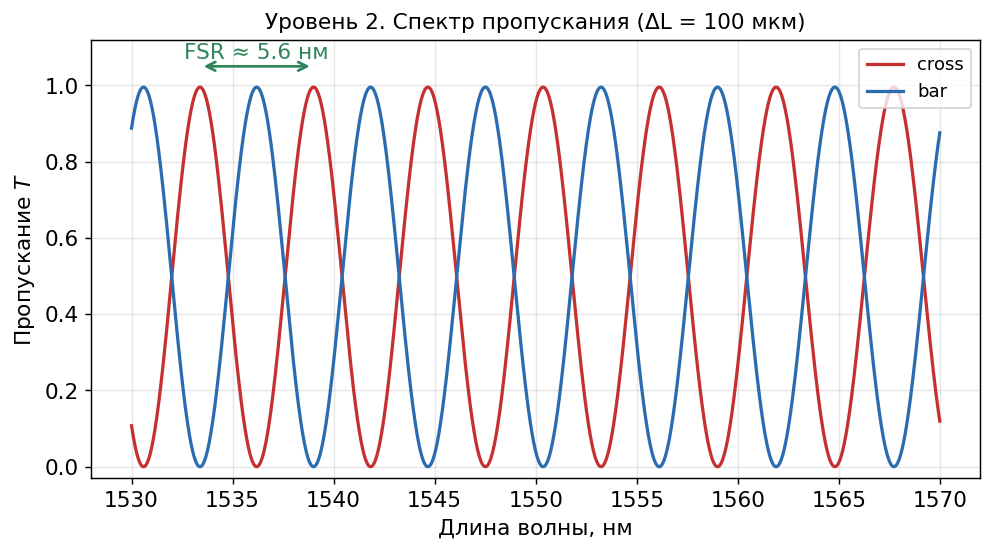
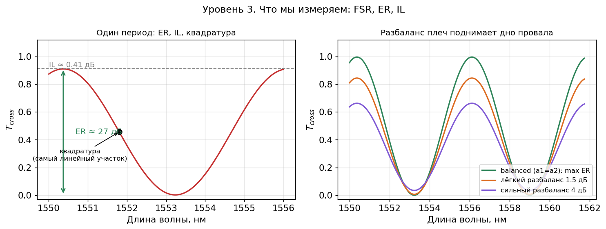
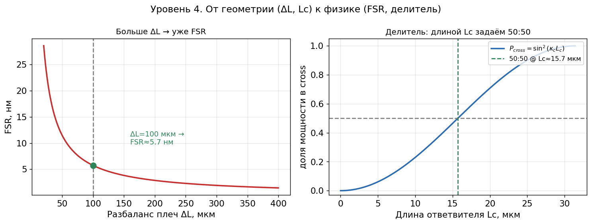
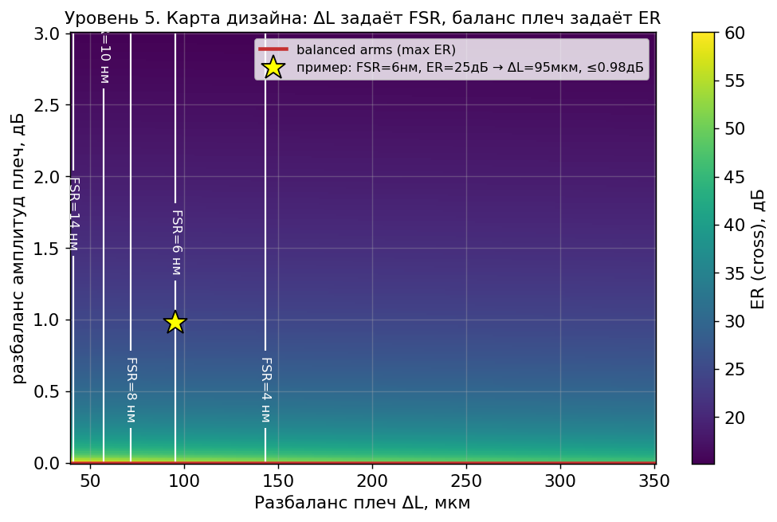
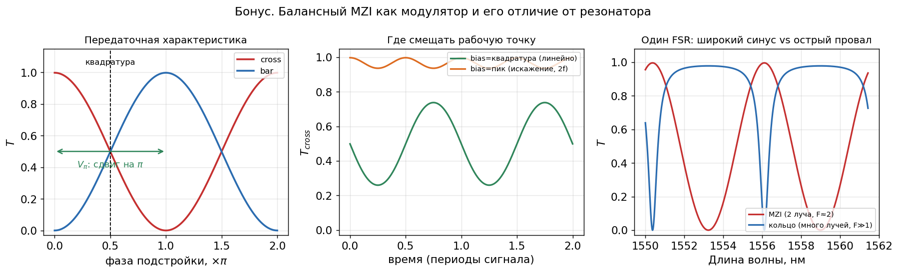
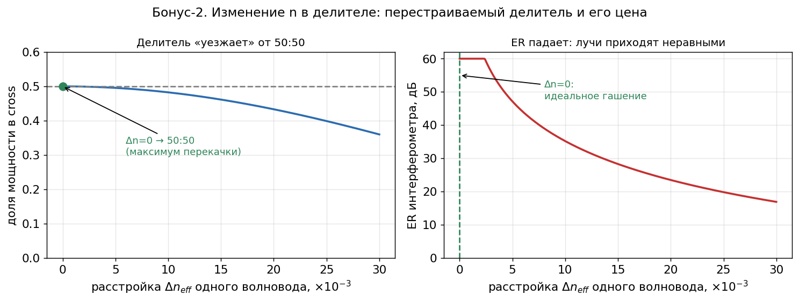

# Интерферометр Маха–Цендера: от физики к геометрии

*Короткая методичка для 2 курса. Что такое интерферометр Маха–Цендера, как он работает и как посчитать его «руками» на Python.*

Интерферометр Маха–Цендера (MZI) — это два направленных ответвителя, соединённых двумя волноводами-плечами. На входе свет делится пополам, идёт по двум плечам и снова сходится во втором ответвителе. Если в плечах он набрал **одинаковую фазу**, лучи складываются в одном выходе; если фазы разошлись на полпериода — гасят друг друга в этом выходе и уходят в другой. Меняя разность фаз — длиной плеч или нагревом — мы перекидываем свет между двумя выходами. Именно поэтому MZI — это рабочая лошадка фотоники: модуляторы, переключатели, фильтры, (де)мультиплексоры.

**Что понадобится:** базовая Python (numpy, matplotlib), комплексная экспонента $e^{i\varphi}$, модуль $|z|^2$, матрица 2×2. Всё остальное разберём по ходу.

**Платформа в примерах:** кремниевый волновод SOI strip 220×500 нм, TE-мода, $\lambda \approx 1550$ нм.

## Как запустить код

```bash
pip install numpy matplotlib
python mzi_tutorial.py     # построит все 7 рисунков в папку images/
```

В каждом разделе ниже — короткий фрагмент, использующий функции из `mzi_tutorial.py`. Формулы в `$...$` рендерятся прямо на GitHub.

---

## Уровень 1. Из чего собран MZI



**Идея.** Устройство состоит из трёх частей: входной **делитель** (ответвитель), два **плеча** и выходной **сумматор** (ещё один ответвитель). Каждый ответвитель описываем матрицей 2×2: часть амплитуды проходит прямо ($t$ — self-coupling), часть переходит в соседний волновод ($\kappa$ — cross-coupling). Энергия в самом ответвителе сохраняется:

$$t^2 + \kappa^2 = 1, \qquad C = \begin{pmatrix} t & -i\kappa \\ -i\kappa & t \end{pmatrix}$$

Для делителя **50:50** нужно $t^2 = \kappa^2 = \tfrac12$.

В каждом плече длиной $L_i$ свет, во-первых, набирает фазу, во-вторых, немного затухает:

$$\text{фаза:}\quad \varphi_i = \frac{2\pi\, n_{\text{eff}}\, L_i}{\lambda}, \qquad \text{амплитуда выживает в}\quad a_i = e^{-\alpha L_i/2}$$

где $n_{\text{eff}}$ — эффективный индекс моды, $\alpha$ — потери на единицу длины, $\lambda$ — длина волны. Всю физику интерференции определяет **разность фаз** между плечами:

$$\Delta\varphi = \frac{2\pi\, n_{\text{eff}}\, \Delta L}{\lambda} + \varphi_{\text{tune}}, \qquad \Delta L = L_{\text{long}} - L_{\text{short}}$$

Здесь $\Delta L$ — геометрический **разбаланс плеч**, а $\varphi_{\text{tune}}$ — внешняя подстройка (нагрев, напряжение).

```python
from mzi_tutorial import arm_phase, arm_amplitude, splitter_cross_power, Lc_for_5050

print("Lc для делителя 50:50 =", Lc_for_5050(), "мкм")
print("Доля мощности в cross при этой длине =", splitter_cross_power(Lc_for_5050()))
print("Амплитуда выживает в плече 150 мкм:", arm_amplitude(150.0))
```

**Что запомнить:** всё устройство задаётся двумя «ручками» — разностью фаз $\Delta\varphi$ (через $\Delta L$ и подстройку) и делением ответвителей (через их длину). К ним мы и сведём дизайн.

---

## Уровень 2. Спектр пропускания и условие интерференции



Перемножив три матрицы $M = C \cdot P \cdot C$ (делитель → плечи → сумматор, $P$ — диагональная матрица плеч), получаем пропускание двух выходов. Свет подан в верхний порт; **bar** — выход с той же стороны, **cross** — с противоположной:

$$T_{\text{cross}} = \kappa^2 t^2\left(a_1^2 + a_2^2 + 2 a_1 a_2 \cos\Delta\varphi\right)$$

$$T_{\text{bar}} = t^4 a_1^2 + \kappa^4 a_2^2 - 2 t^2 \kappa^2 a_1 a_2 \cos\Delta\varphi$$

Для идеального случая (50:50, без потерь, $a_1 = a_2 = 1$) это сводится к знакомому:

$$T_{\text{cross}} = \cos^2\!\frac{\Delta\varphi}{2}, \qquad T_{\text{bar}} = \sin^2\!\frac{\Delta\varphi}{2}, \qquad T_{\text{bar}} + T_{\text{cross}} = 1$$

Выходы **дополняют** друг друга: куда свет ушёл из одного, туда добавился в другом. На рисунке это два синуса в противофазе.

```python
import numpy as np
from mzi_tutorial import mzi_transmission

lam = np.linspace(1.530, 1.570, 4000)        # длины волн, мкм
T_bar, T_cross = mzi_transmission(lam, dL=100.0)
print("Минимум cross-выхода:", T_cross.min())  # глубина гашения
```

**Что видно на рисунке:** плавные синусоидальные полосы (fringes) через равные промежутки. Важное отличие от кольца: здесь интерферируют всего **два луча**, поэтому полосы широкие и гладкие, без острых резонансов.

---

## Уровень 3. Что мы измеряем: FSR, ER, IL



Из спектра вытаскивают три ключевые характеристики (FOMs — figures of merit).

**1) FSR (Free Spectral Range)** — период спектра (расстояние между соседними максимумами одного выхода):

$$\text{FSR} = \frac{\lambda^2}{n_g\, \Delta L}$$

Та же формула, что у кольца, только вместо длины оборота $L$ стоит **разбаланс плеч** $\Delta L$. Здесь $n_g = n_{\text{eff}} - \lambda\,\dfrac{dn_{\text{eff}}}{d\lambda}$ — групповой индекс (поправка на дисперсию). Чем больше $\Delta L$, тем уже FSR. Частный случай $\Delta L = 0$ — **балансный** MZI: спектр плоский, прибор работает чистым переключателем по $\varphi_{\text{tune}}$.

**2) ER (Extinction Ratio)** — глубина гашения в децибелах. На cross-выходе минимум достигается при $\cos\Delta\varphi = -1$:

$$T_{\text{cross}}^{\min} = \kappa^2 t^2 (a_1 - a_2)^2 \quad\Rightarrow\quad \text{ER} = 20\log_{10}\left|\frac{a_1 + a_2}{a_1 - a_2}\right|$$

Гашение идеально (ER → ∞), когда **амплитуды плеч равны**, $a_1 = a_2$. Это «критическое» условие MZI — прямой аналог критической связи кольца, только вместо «связь = потери» здесь «амплитуда плеча 1 = амплитуда плеча 2». Правая панель рисунка показывает, как разбаланс плеч поднимает дно провала.

> **Тонкость про два выхода.** Глубокий ноль на *cross* требует баланса плеч ($a_1=a_2$), а глубокий ноль на *bar* — деления ровно 50:50 ($t^2=\kappa^2$). Для хорошего переключателя нужно и то, и другое.

**3) IL (Insertion Loss)** — вносимые потери на пике: $\text{IL} = -10\log_{10}(T_{\text{cross}}^{\max})$, где $T_{\text{cross}}^{\max} = \kappa^2 t^2 (a_1 + a_2)^2$. Их поднимают потери в плечах и отклонение делителя от 50:50.

**Про «остроту».** У кольца есть добротность $Q$ — резонанс можно сделать сколь угодно узким. У MZI форма линии — это $\cos^2$, её «финесс» **фиксирован** и равен примерно 2: это двухлучевой интерферометр, а не резонатор. Узость полос здесь не настраивается — настраивается только их период (через $\Delta L$).

```python
from mzi_tutorial import FSR, extinction_ratio_cross_dB, insertion_loss_cross_dB

print("FSR =", FSR(100.0) * 1000, "нм")
print("ER  =", extinction_ratio_cross_dB(100.0, imbalance_dB=0.8), "дБ")
print("IL  =", insertion_loss_cross_dB(100.0, imbalance_dB=0.8), "дБ")
```

---

## Уровень 4. От геометрии к физике



Инженер крутит **геометрию** ($\Delta L$, длину ответвителя $L_c$, мощность нагревателя), а формулы выше работают с **физикой** ($\Delta\varphi$, $t$, $\kappa$). Связь такая:

**Разбаланс плеч → FSR.** Напрямую из формулы FSR: $\Delta L = \dfrac{\lambda^2}{n_g\,\text{FSR}}$. Левая панель: гипербола, чем длиннее «лишний» кусок плеча, тем плотнее полосы.

**Длина ответвителя → деление.** В направленном ответвителе доля перешедшей мощности зависит от длины области сближения:

$$P_{\text{cross}} = \sin^2(\kappa_c L_c)$$

где $\kappa_c$ — сила связи (зависит от зазора, как и у кольца). Деление 50:50 достигается при $\kappa_c L_c = \pi/4$. Правая панель: подбирая $L_c$, попадаем точно в половину.

**Подстройка фазы → нагрев.** Кремний сильно меняет показатель преломления с температурой ($dn/dT \approx 1.86\times10^{-4}$ /К). Нагреватель длиной $L_h$ при перегреве $\Delta T$ добавляет фазу:

$$\varphi_{\text{tune}} = \frac{2\pi}{\lambda}\,\frac{dn}{dT}\,\Delta T\, L_h$$

Сдвиг на $\pi$ (полное переключение выхода) — это и есть тепловой аналог напряжения $V_\pi$ у электрооптических модуляторов.

```python
from mzi_tutorial import thermo_phase, heater_length_for_pi, Lc_for_5050

print("Длина ответвителя 50:50:", Lc_for_5050(), "мкм")
print("Нагреватель на сдвиг π при ΔT=30 К:", heater_length_for_pi(30.0), "мкм")
print("Фаза от нагрева (Lh=140 мкм, ΔT=30 К):", thermo_phase(140.0, 30.0), "рад")
```

---

## Уровень 5. Обратная задача: подбираем геометрию под спецификацию



Теперь идём **наоборот**: заданы целевые FSR и ER — найти геометрию.

1. **Разбаланс из FSR:** $\;\Delta L = \dfrac{\lambda^2}{n_g\,\text{FSR}}$.
2. **Делитель 50:50:** длина $L_c = \dfrac{\pi}{4\kappa_c}$ (нужна для максимальной видности полос).
3. **Бюджет баланса плеч под ER:** из $\text{ER} = 20\log_{10}\dfrac{a_1+a_2}{|a_1-a_2|}$ находим максимально допустимый разбаланс амплитуд, переводим в допуск по потерям одного плеча (в дБ).
4. **Нагреватель:** длину $L_h$ выбираем так, чтобы доступного перегрева хватило на сдвиг $\pi$.
5. **Проверки:** допуск по балансу плеч реалистичен для литографии (доли дБ); делитель не «уехал» от 50:50.

На карте: **цвет** — ER на cross-выходе, **белые вертикальные линии** — постоянный FSR (зависит только от $\Delta L$), **красный гребень снизу** — баланс плеч $a_1=a_2$ (максимальный ER, аналог критической связи), **звезда** — пример найденного дизайна.

```python
from mzi_tutorial import design_for_FSR_ER

d = design_for_FSR_ER(FSR_target=0.006, ER_target=25.0)   # FSR=6 нм, ER=25 дБ
print(f"ΔL = {d['dL']:.0f} мкм,  Lc(50:50) = {d['Lc_5050']:.1f} мкм")
print(f"допуск разбаланса плеч ≤ {d['max_imbalance_dB']:.2f} дБ,  выполнимо: {d['fab_ok']}")
# -> ΔL ≈ 95 мкм, допуск ≈ 0.98 дБ
```

---

## Бонус: балансный MZI как модулятор (и чем он отличается от кольца)



Самое частое применение MZI — **модулятор/переключатель**. Берём балансный MZI ($\Delta L = 0$) и крутим только фазу $\varphi_{\text{tune}}$ (нагревом или напряжением). Левая панель — передаточная характеристика: выходы плавно перекачиваются друг в друга, полный размах достигается за сдвиг $\pi$ (тот самый $V_\pi$).

**Где смещать рабочую точку (средняя панель).** Это неочевидный, но важный момент:

1. В точке **квадратуры** ($\Delta\varphi = \pi/2$, $T = 1/2$) характеристика самая крутая и почти линейная — малый сигнал передаётся без искажений. Сюда смещают аналоговые модуляторы.
2. На **пике или в нуле** ($T = 1$ или $0$) наклон нулевой, и синусоидальный сигнал выходит искажённым с **удвоенной частотой**. Видно на оранжевой кривой.

**Двухлучевой против многолучевого (правая панель).** При одинаковом FSR форма линии у MZI (широкий синус, финесс ≈ 2) и у кольца (острый узкий провал, финесс ≫ 1) совершенно разная. Причина простая: в кольце свет проходит **много оборотов** и интерферирует сам с собой многократно — отсюда острый резонанс и высокая добротность. В MZI интерферируют всего **два луча за один проход** — отсюда гладкие широкие полосы.

**Практический вывод:** если нужен острый узкополосный фильтр — берут кольцо; если нужен широкополосный, технологически устойчивый модулятор/переключатель с предсказуемой характеристикой — берут MZI.

```python
import numpy as np
from mzi_tutorial import mzi_transmission

phi = np.linspace(0, 2 * np.pi, 600)
T_bar, T_cross = mzi_transmission(1.55, dL=0.0, phi_tune=phi)  # балансный MZI
# квадратура: phi=pi/2 -> T_cross=0.5, максимальная крутизна
```

## Бонус-2: что меняет изменение n в самом делителе



До сих пор мы крутили фазу в плечах. А что, если поменять показатель преломления (а значит $n_{\text{eff}}$) прямо **в делителе** — например, нагревателем над зоной связи? Здесь важно, **как** менять:

- Если сдвинуть $n_{\text{eff}}$ **обоих** волноводов ответвителя одинаково — они остаются согласованными, и коэффициент деления почти не меняется (добавляется лишь общая фаза).
- Если внести **асимметрию** (нагреть один волновод, или сделать его чуть шире) — появляется **расстройка** постоянных распространения:

$$\delta = \frac{\pi\, \Delta n_{\text{eff}}}{\lambda}$$

и доля перекачанной мощности становится

$$P_{\text{cross}} = \frac{\kappa_c^2}{\kappa_c^2 + \delta^2}\,\sin^2\!\left(\sqrt{\kappa_c^2 + \delta^2}\; L_c\right).$$

Меняются **две** вещи (левая панель рисунка): во-первых, падает сам **максимум** перекачки — множитель $\kappa_c^2/(\kappa_c^2+\delta^2)<1$; при сильной расстройке волноводы перестают обмениваться светом вообще. Во-вторых, деление уходит от 50:50.

А дальше включается то же правило, что и для плеч: **глубокое гашение в MZI требует, чтобы в сумматор пришли равные амплитуды двух лучей.** Делитель не 50:50 нарушает именно это — поэтому ER падает, видность полос ухудшается, IL растёт (правая панель). При этом FSR не трогается: он задан только $\Delta L$.

Та же физика — это и **возможность**: управляя $n$, можно осознанно перестраивать коэффициент деления. MZI, у которого обе связи перестраиваемые плюс есть фазовращатель в плече, реализует произвольную матрицу 2×2 — это «ячейка» программируемой фотоники (оптические процессоры, нейросети, квантовые схемы).

> **Тонкость про масштаб.** Чтобы заметно сдвинуть деление, нужна $\Delta n_{\text{eff}}\sim 10^{-2}$ — это больше, чем даёт термооптика одного нагревателя ($dn/dT\cdot\Delta T \sim 10^{-3}$ при $\Delta T\sim 50$ К). Поэтому на практике перестраиваемый делитель чаще делают не нагревом направленного ответвителя, а как **маленький вложенный MZI** — но физика «расстройка → деление уходит от 50:50 → ER падает» остаётся той же.

```python
from mzi_tutorial import splitter_cross_power_detuned, extinction_ratio_split_dB, Lc_for_5050

Lc = Lc_for_5050()
print("деление при Δn=0:   ", splitter_cross_power_detuned(Lc, 0.0))    # 0.50
print("деление при Δn=0.01:", splitter_cross_power_detuned(Lc, 0.01))   # ~0.48
print("ER MZI при Δn=0.01: ", extinction_ratio_split_dB(
      splitter_cross_power_detuned(Lc, 0.01)), "дБ")                    # ~35 дБ
```

## Что попробовать самому (упражнения)

1. Постройте спектр для $\Delta L = 50$ и $\Delta L = 200$ мкм. Как меняется FSR? Сверьте с формулой.
2. Зафиксируйте $\Delta L = 100$ мкм и меняйте `imbalance_dB` от 0 до 3 дБ. Постройте ER как функцию разбаланса — где он уходит в бесконечность?
3. Сделайте обратный дизайн под FSR = 10 нм и ER = 30 дБ. Какой нужен $\Delta L$ и насколько жёсткий допуск на баланс плеч?
4. Сделайте делители неидеальными: задайте разные `split` и `split2` в `mzi_transmission` (теперь это поддерживается). Что произойдёт с нулём на bar-выходе, а что — на cross? Сверьте с Бонусом-2.
5. Подайте на балансный MZI синусоидальную $\varphi_{\text{tune}}$ со смещением $\pi/2$ и $0$. Сравните спектр выходного сигнала (подсказка: FFT) — где появляется вторая гармоника?

---

### Краткий словарь обозначений

| Символ | Что это | Единицы |
|---|---|---|
| $\Delta L$ | разбаланс плеч ($L_{\text{long}}-L_{\text{short}}$) | мкм |
| $\Delta\varphi$ | разность фаз между плечами | рад |
| $\varphi_{\text{tune}}$ | внешняя подстройка фазы (нагрев) | рад |
| $t,\ \kappa$ | прошло прямо / перешло в делителе | — |
| $a_i = e^{-\alpha L_i/2}$ | выживание амплитуды в плече | — |
| $\alpha$ | потери распространения | 1/мкм |
| $L_c$ | длина направленного ответвителя | мкм |
| $L_h,\ \Delta T$ | длина нагревателя, перегрев | мкм, К |
| $n_{\text{eff}},\ n_g$ | эффективный / групповой индекс | — |
| FSR, ER, IL | период, глубина гашения, вносимые потери | нм, дБ, дБ |
